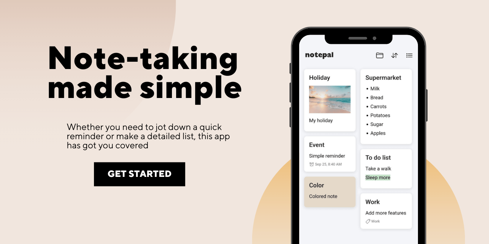

# Notepal

Mobile app for taking notes, to-do list, shopping list with reminders and much more.

This app has been built with Ionic and Angular and supports only Android.

## Preview

https://github.com/user-attachments/assets/66d504ea-aad1-4b2c-86e2-c2c8bed1e05c

## Features
- :art: Colorful Backgrounds
- :alarm_clock: Set Reminders
- :calendar: Calendar to handle notes
- :file_folder: Categories to keep notes organized
- :last_quarter_moon: Light/Dark theme

## Contributing

Contributions to Notepal are always welcome!

See the [contribution guide](CONTRIBUTING.md) if you want to be a part of this project, it takes less than 2 minutes to get started.

## License

This project is licensed under the Apache-2.0 License - see the [LICENSE](LICENSE) file for more details.
